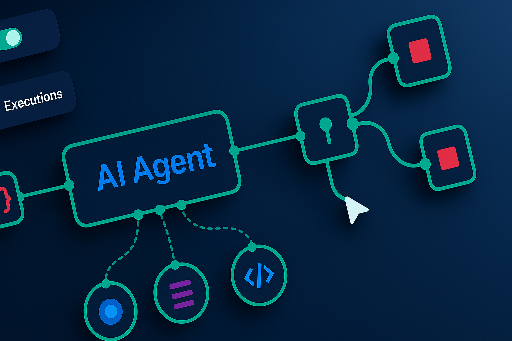

# Automation: Why It's the Future of Every Small Business

## Description

Small businesses that thrive in 2025 won't work harder—they'll work smarter. Automation is now affordable and accessible for every type of business.

**Welcome to FIT Automate: Your Partner in AI Workflow Automation!**

Small businesses are under more pressure than ever. Costs are rising, hiring is harder, and customers expect fast, consistent service. The companies that grow in 2025 and beyond won't be the ones working harder — they'll be the ones working smarter.

That's where automation comes in.

Automation isn't just for big companies. Modern tools now make it affordable, flexible, and accessible for every type of business, from consultants to trades, retail, real estate, professional services, and everything in between.

### **Why automation matters right now**

- **It saves time instantly.** Tasks like scheduling, data entry, notifications, reminders, and follow-ups can all run automatically.
- **It reduces errors and delays.** Systems don't forget, overlook, or "get busy."
- **It creates a better experience for customers.** Faster responses, smoother workflows, and consistent communication build trust.
- **It gives owners their time back.** Less admin, more strategy, more growth.

### **The shift has already started**

Across every industry, more and more small businesses are adopting automated workflows to keep up. What used to take hours can now be done in seconds. And new AI-powered tools are making it even easier to connect systems, streamline operations, and scale without adding headcount.

### **Where to begin**

Start small. Automate one process — something repetitive, manual, and time-consuming.
Once you see the impact, it becomes clear how many opportunities exist across your business.

Whether you're planning ahead for the new year or looking to solve today's bottlenecks, automation is no longer optional. It's the foundation for the next decade of growth.

*At Forward IT Thinking (FIT), we help businesses identify the right workflows, design smarter processes, and implement automation that delivers real results. Want to learn more You can always reach us through our contact page.*
