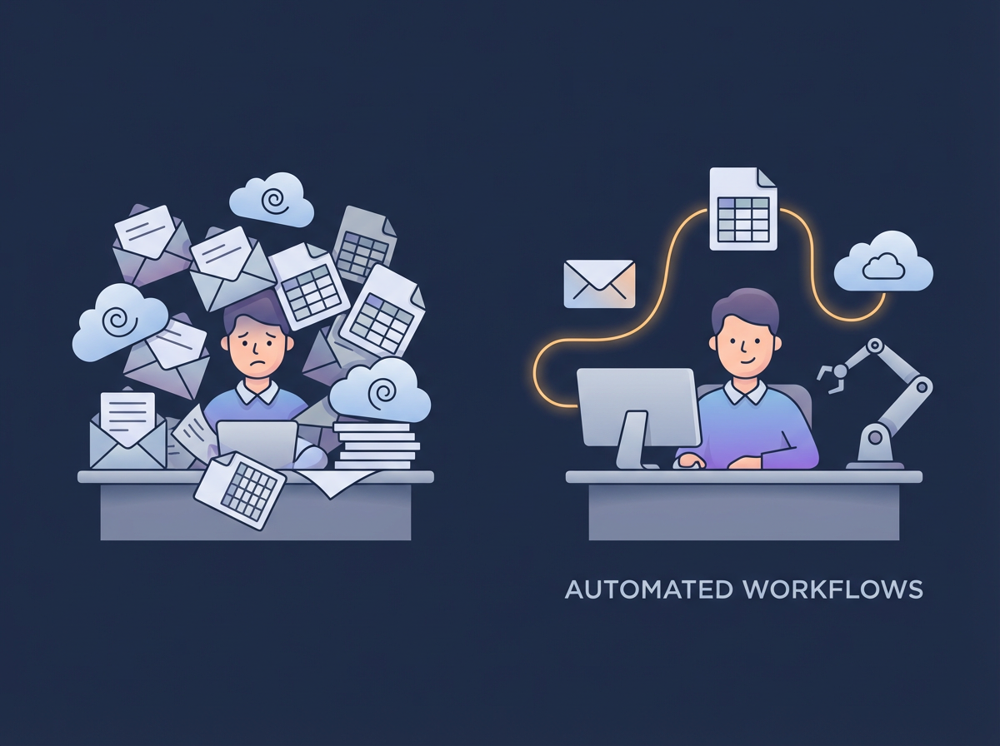

# What Small Businesses Get Wrong About Automation

## Description

Automation isn't complicated, expensive, or just for big companies. Here are the three most common misconceptions holding small businesses back—and why they're wrong.

#### Automation is one of the most misunderstood tools in small business today.

Every small business owner has heard the buzz around automation — but few feel confident about it.

Some think it’s too technical.
Some think it’s too expensive.
Most think it’s meant for bigger companies with bigger teams and bigger budgets.

But here’s the truth:
**
Small businesses often stand to gain the most from automation — and the biggest obstacles are usually misunderstandings, not technology.**

Let’s clear up the three most common misconceptions we see every day.

------

## **1. “Automation is complicated — I don’t have time to figure it out.”**

Most small business owners picture automation as coding, servers, IT projects, or major system overhauls.

In reality, today’s tools are simple, visual, and built for non-technical users.
Automations can be:

- “When this email arrives, do this”
- “When a form is filled, update this sheet”
- “When a task is overdue, send a reminder”

You don’t need to overhaul your business.
You just need to remove the repetitive tasks slowing you down.

**Small automations often take minutes to build — and save hours every week.**

------

## **2. “We’re too small for automation. We just do things manually.”**

This belief is one of the biggest reasons small businesses fall behind.

Manual work feels manageable… until it isn’t.

Re-typing data. Forwarding emails. Tracking updates in spreadsheets.
These bottlenecks grow quietly, and suddenly one person becomes the whole system holding everything together.

Automation isn’t about size — it’s about **removing friction**.

If a task is:

- repetitive
- predictable
- rule-based

…it can usually be automated, no matter how small the business is.

Even VERY small teams often save **10–20 hours a month** with just one or two simple automations.

------

## **3. “Automation replaces people — and that’s not what we want.”**

This is another myth.

Small businesses rarely automate to replace staff.
They automate to:

- reduce busywork
- prevent mistakes
- free people to focus on customers
- avoid burnout
- speed up operations
- reduce dependency on any one person

Automation isn’t about removing humans.
It’s about **supporting** them — giving your team more time for the work that matters.

------

## **The real problem isn’t automation — it’s the assumptions around it**

Small businesses don’t struggle because automation is hard.
They struggle because it’s unfamiliar.

Once you see how simple and practical modern tools can be, the fear disappears — and the benefits show up fast.

**The businesses that thrive are the ones that remove friction early.**