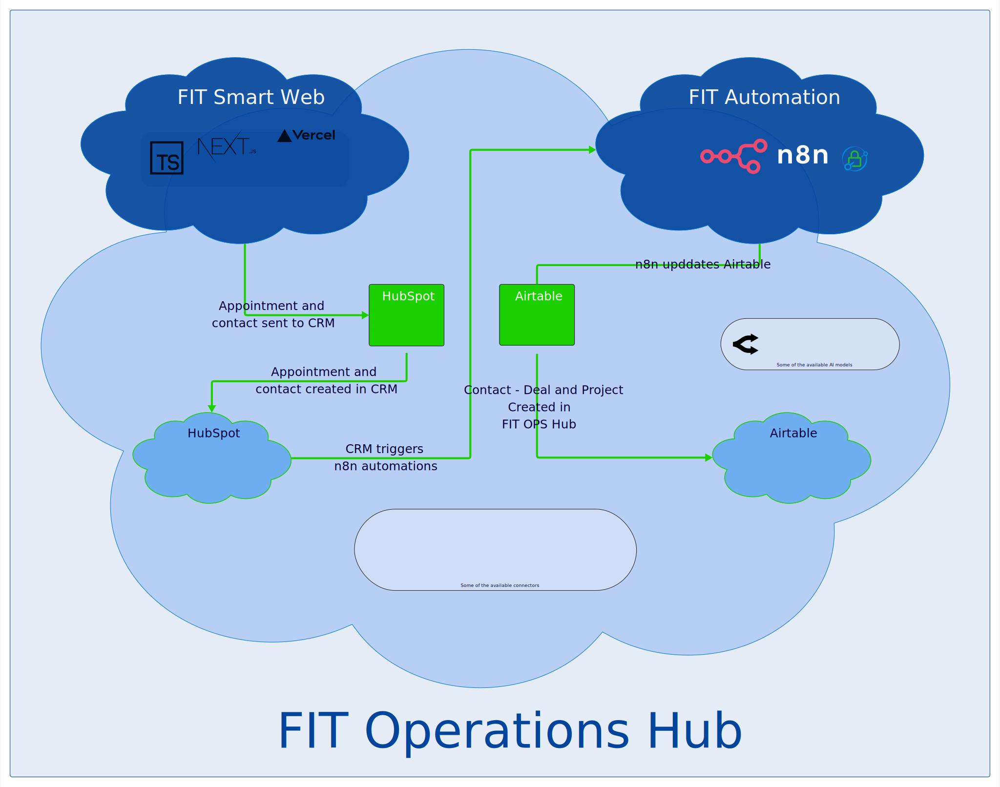

# Welcome to the FIT Automate Blog

## Automation for the real world, built with human clarity

Forward IT Thinking (FIT) helps SMBs turn repetitive work into reliable workflows — with security, approvals, and audit trails built in from day one. Practical automation, without losing control.

!!! tip "Core promise"
    Build approachable automation, keep humans informed, and never compromise on control, traceability, or accountability.

---

## Why now

### Automation finally fits how teams actually work

The pace has changed fast. Teams can prototype secure workflows in days — sometimes hours — instead of weeks and months. But most businesses still run critical work through email, spreadsheets, and manual handoffs because the automation projects they’ve seen were too risky, too brittle, or didn’t get adopted.

Forward IT Thinking exists to change that. We build practical automations with the guardrails teams need: approvals, visibility, audit trails, and human-in-the-loop checkpoints — so you get real operational relief without losing control.

---

## The founder

### Behind the mission

With 20+ years of operations and IT leadership, I’ve seen automation projects either drift into risky territory or stall under the weight of compliance. Forward IT Thinking is the alternative: grounded automation, repeatable guardrails, and the personal attention that keeps teams confident every step of the journey.

- Built secure workflows for finance, operations, and IT teams at scale.
- Focused on clarity, not hype: practical automations your people will trust.
- Champions the human-in-the-loop philosophy so no decision is outsourced.

**John Bewley** — Founder & Automation Lead  
[Meet with John](https://forwarditthinking.com/contact)

---

## Our philosophy

| Principle | What it means |
|---|---|
| **Security First** | We make approvals, logging, and least-privilege the default before anything automates. |
| **Practical Wins** | Every sprint delivers something usable — no theoretical experiments, just measurable ops relief. |
| **Human-in-the-loop** | Automation amplifies your team, but people stay responsible for every decision along the way. |
| **Confident Handoff** | Documentation, playbooks, and checkpoints keep your crew confident long after launch. |

---

## Mission

### Restoring Focus to Your Team

To help small and mid-sized businesses reclaim time and reduce chaos by transforming repetitive manual tasks into reliable, AI-powered workflows.

We build human-first automation so teams can stay focused on strategy while approvals, checks, and escalations run automatically and visibly.

---

## Vision

### Enterprise Power, Accessible to All

A world where every SMB operates with the same efficiency, automation, and capability as enterprise organizations — without the complexity, cost, or confusion.

 